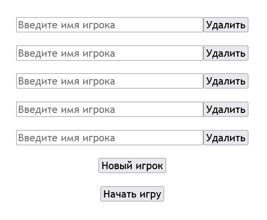
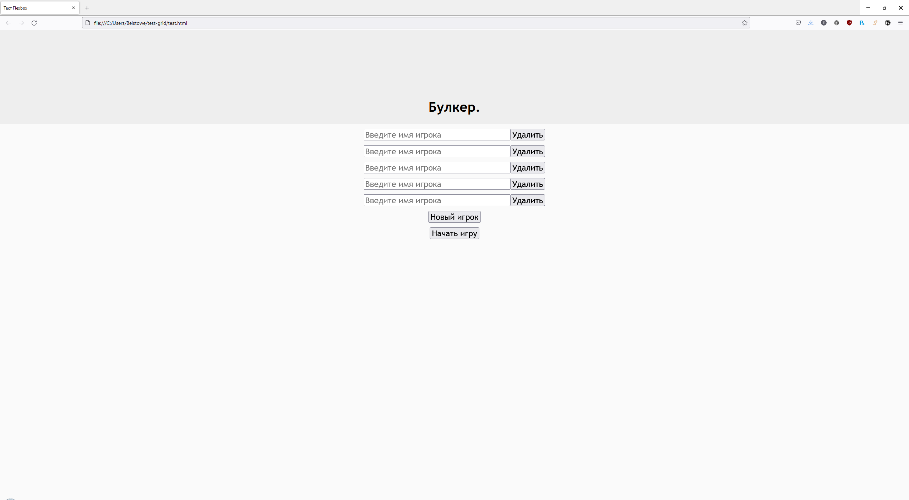
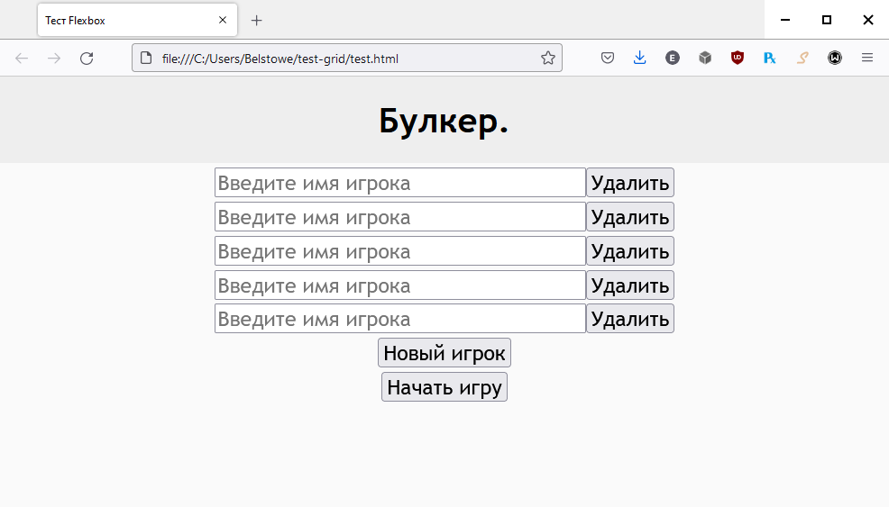

Задача #1: Меню ввода имён игроков
==================================

Введение
--------

Перед игрой в Бункер ведущему требуется определить всех игроков в этой игре.

В изначальном варианте, где всё размещалось на одной странице, все игроки вводились напрямую в таблицу.

Однако более понятным (для пользователя) и простым способом, с моей точки зрения, является ввод отдельного *меню инициализации*.

У ведущего запрашивают список игроков, который тот вводит и нажимает "Продолжить". Сервер инициализирует игроков и происходит переход на следующую страницу, в сам сеанс игры.

Такое меню может стать отличным вводным заданием в разработку.

Вёрстка
-------

Для меню запросов мною предлагается использовать следующий план:

Каждый ряд в этом примере представляет собой контейнер. Контейнеры на ввод имён дополнительно пронумерованы для их различия обработчиком событий. Все эти контейнеры, в свою очередь, являются элементами гибкого контейнера **CSS flexbox**.

Такое оформление не обязательно и является лишь одним из предложений.

Естественно, это совсем спартанский вариант, который касается лишь функционального вопроса. Если затронуть вдобавок тему декорации, в идеале стоит ещё добавить шапку (например, с логотипом проекта) и нижний колонтитул (с копирайтом и прочими плюшками).

Ниже приведён пример более развитой темы, построенной через использование **CSS Grid**. Тоже простецкая, но из плюсов имеет масштабируемость:

    Макет страницы при большом разрешении.

    Макет страницы при малом разрешении.

Код данного макета приведён в конце. Но имейте ввиду, что кнопки не работают по понятной причине: скрипты не написаны. :)

Если нет идей с декорациями, вопрос с оформлением этого меню можно отложить на потом. Дизайнер когда-нибудь что-нибудь да накалякает.

Задание
-------

#. Очистить текущую вёрстку от шаблонов, завезённых в начале.
#. Сверстать свой макет. Рекомендуется использовать гибкие модули из CSS3: *Grid* или *Flexbox*.
#. Добавить для каждой кнопки скрипты:
    #. **Новый игрок:** Добавление нового контейнера с запросом имени.
    #. **Удалить:** Удаление контейнера, где находится кнопка.
    #. **Начать игру:** Передача серверу имён для инициализации игроков. *Необходимо взаимодействие с backend.*

Материалы для ознакомления
--------------------------

* Источники по CSS3 Flexbox: `HTML5Book Flexbox (Ru) <https://html5book.ru/css3-flexbox/>`_, `Joy Shaheb (En) <https://www.freecodecamp.org/news/css-flexbox-tutorial-with-cheatsheet/>`_.
* Источники по CSS3 Grid: `HTML5Book Grid (Ru) <https://html5book.ru/css-grid/>`_, `Joy Shaheb (Ru) <https://habr.com/ru/company/macloud/blog/564182/>`_.
* `Microsoft Docs (Русский): Формы и проверка ASP.NET Core Blazor <https://docs.microsoft.com/ru-ru/aspnet/core/blazor/forms-validation?view=aspnetcore-5.0>`_

Статический макет
-----------------

.. code-block:: html
    :linenos:

    <!DOCTYPE html>
    <html>
        <head>
            <meta charset="UTF-8">
            <title>Тест Flexbox</title>
            
        </head>

        <body>
            

                

                    

                        <h1>Булкер.</h1>
                    

                

                

                    

                        <input type="text" placeholder="Введите имя игрока" maxlength="32" size="36" />
                        <input type="button" value="Удалить" />
                    

                    

                        <input type="text" placeholder="Введите имя игрока" maxlength="32" size="36" />
                        <input type="button" value="Удалить" />
                    

                    

                        <input type="text" placeholder="Введите имя игрока" maxlength="32" size="36" />
                        <input type="button" value="Удалить" />
                    

                    

                        <input type="text" placeholder="Введите имя игрока" maxlength="32" size="36" />
                        <input type="button" value="Удалить" />
                    

                    

                        <input type="text" placeholder="Введите имя игрока" maxlength="32" size="36" />
                        <input type="button" value="Удалить" />
                    

                    

                        <input type="button" value="Новый игрок" />
                    

                    

                        <input type="button" value="Начать игру" />
                    

                

            

        </body>
    </html>