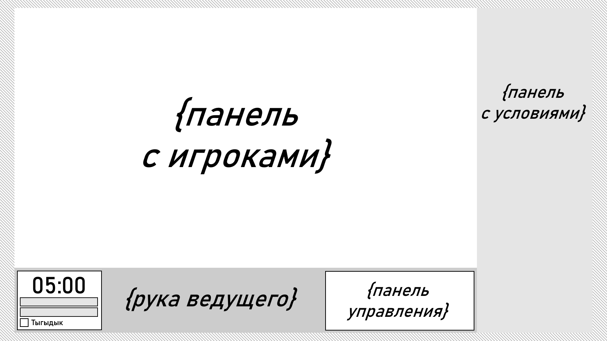
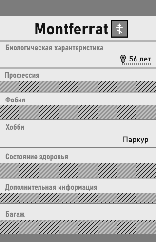
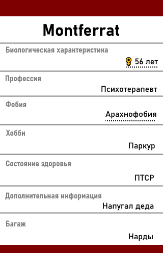
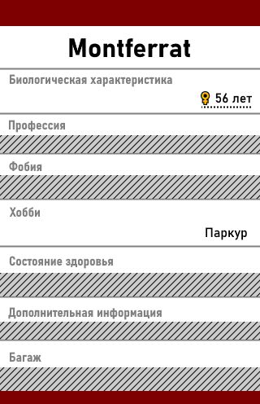
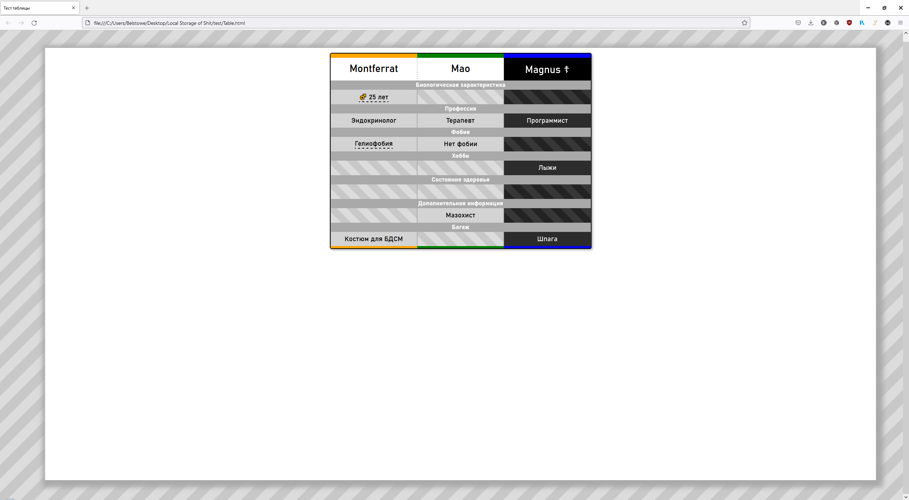
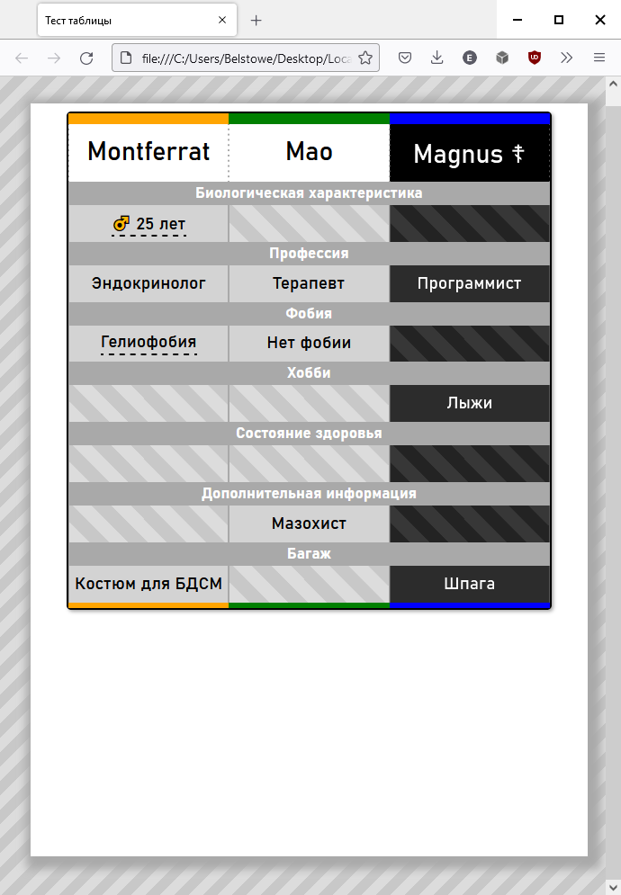
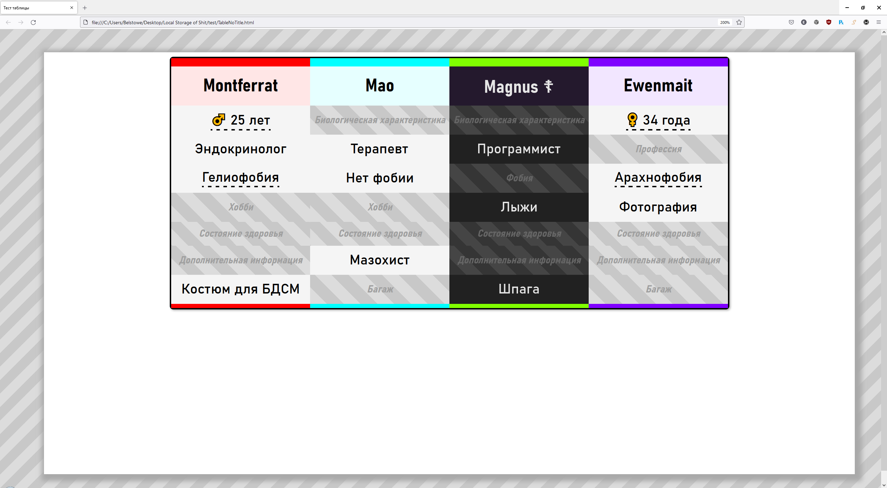

Задача #2: Макет игры. Махинации с игроками 
===========================================

После первого разогревочного задания идёт, конечно, самая сложная основная часть.

В данной задаче вами будет определён облик самой главной страницы, где будет протекать игра.

Макет главной страницы
----------------------

Следующий план я нарисовал в редакторе, так что HTML-скрипта под него у меня нет (но повторить его, думаю, не составит труда):

Можно отметить 3 панели: самая большая панель с игроками (занимает 80%/80% пространства), нижняя панель ведущего (80%/20%) и боковая панель условий (20%/100%).

В общем и целом такой интерфейс подобен тому, что был в оригинальном Булкере, но теперь он растягивается практически на весь экран (самые края (~5%) я бы всё же не задействовал, заштриховал и выделил бы полезную часть тенью).

Контейнер игрока
----------------

Несмотря на предыдущее заявление, что вряд ли лучше таблицы я что-нибудь придумаю, всё же что-нибудь более-менее приятное на глаз придумать хотелось *(ибо таблица, честно, смотрится не очень)*.

Мне совсем не нравилось, что виды характеристик находились в крайнем столбце, отчего приходилось метаться взглядом, чтобы найти подходящие столбец и строку. Да и вид был не очень, и вряд ли бы можно было это изменить.

Так что мною предлагаются 2 других подхода к дизайну:

"Каждому по контейнеру"
~~~~~~~~~~~~~~~~~~~~~~~

Такой подход даёт большой простор для фантазий, а соответственно для будущего дизайна; позволяет сам дизайн сделать более привлекательным; переделать затем контейнеры в таблицу легче, чем таблицу в набор контейнеров.

В качестве прототипа можно использовать следующий дизайн:

    Вид мёртвого игрока

    Вид с раскрытыми хар-ками

    Вид с нераскрытыми хар-ками

.. note::
    Используемый здесь шрифт: **Bahnschrift**.

С прототипом вы вольны делать что угодно. Сейчас я бы не сказал, к сожалению, что он хорошо помещается в экран игры. Его пропорции не позволяют ни разместить шаблон в 2 ряда, ни проставить достаточно в 1 ряд.

Так что можете либо *сократить высоту*, вместив `заголовок/значение` в один ряд или как-то объединив шапку с именем, либо *сократить ширину*, используя везде сжатые шрифты и одинаковое выравнивание.

"Таблица с заголовками на отдельной строке"
~~~~~~~~~~~~~~~~~~~~~~~~~~~~~~~~~~~~~~~~~~~

Спасибо Петраркиусу за идею. Эта стратегия мне стала нравиться куда больше, когда я ради интереса её реализовал.

Мы строим таблицу, подобно первому клиенту Булкера *(в данном случае только я заменил стандартную HTML-таблицу на CSS Grid)*, но названия характеристик не располагаются в отдельном боковом столбце: они находятся над рядом со значениями, растягиваясь на всю таблицу.

    
    Вид при большом разрешении

    Вид при пропорциях смартфона (каковы перспективы-то!)

Выходит достаточно красиво и современно; таблицей удобней пользоваться; занимает меньше места по сравнению с прошлым вариантом (и даже меньше, чем в прошлой реализации Булкера!) и масштабируется даже лучше.

Даже вопрос с переносимостью благодаря CSS Grid решается легко. Можно просто увеличить `gap` между контейнерами!

Ещё и код прототипа вам в помощь. Его можно найти в конце статьи.

"Таблица без заголовков"
~~~~~~~~~~~~~~~~~~~~~~~~

Ещё одна идея Петраркиуса. Названия характеристик располагаются поверх нераскрытых ячеек.

Код прототипа тоже будет расположен ниже.

Интерфейс бэк-энда
~~~~~~~~~~~~~~~~~~

Характеристики определяются при инициализации сервером и передаются им через интерфейс ``Dictionary<string, string> IPlayerService.GetTraits()``. Здесь ключ - кодовое название, которое может передаваться как id черты, а значение - выводимое название.

Кроме того, в интерфейсе ``IEnumerable<Player> IPlayerService.GetPlayers()`` сервер передаёт в модели игрока следующие характеристики:

.. code-block:: csharp

    class Player {
        Guid id;
        DateTimeOffset dateCreated;
        string color;  // format: '#FFFFFF'
        String name;
        bool isAlive;
    }

.. note::
    Стоит отдельно объяснить несколько вещей:

    * У игроков есть цветные шапки. У каждого игрока свой уникальный цвет, который генерируется сервером. Такой дизайн необходим для этапа голосования.
    * Характеристики с подробным описанием помечены пунктиром (описание выводится при наведении мышкой). Если у характеристики нет описания, в ``Tooltip`` передаётся пустая строка. 
    * Возраст (кстати, обозначенный Unicode-символом) и пол игрока объединены в единую характеристику `"bio"`, и раскрываются вместе (а в описании выводится фертильность).

События
-------

Выше было описано наведение на поле характеристики, которое подразумевает, что с ним можно взаимодействовать.

Кроме того, что характеристику можно *раскрыть*, ей можно *обменяться* либо *рандомизировать* (когда игрок обыгрывает , например).

Предлагаю следующие действия:

* Чтобы **раскрыть характеристику**, мышка зажимается на заштрихованной черте. Штриховка в это время, например, постепенно переходит в цвет фона. Используется метод ``(string Value, string Tooltip) IPlayerService.GetPlayerTrait(Guid, string TraitKey)``.
* Чтобы **обменять характеристики двух игроков**, мышка нажимается на черте одного игрока и отпускается на нужном игроке. Используется метод ``void IPlayerService.SwapPlayerTrait(Guid subject, Guid object, string TraitKey)``.
* Чтобы **сгенерировать новую черту**, на правой кнопке мыши вызывается контекстное меню с необходимым действием. Используется метод ``void IPlayerService.RandomizePlayerTrait(Guid, string TraitKey)``.

Панель условий
--------------

TBD

Экспорт
-------

TBD

Таймер
------

Таймером можно заняться, пока команда backend медлит.

Каких-то особых рекомендаций по таймеру у меня нет: единственное, рекомендую сделать ввод времени напрямую в таймер, а заморозку сделать просто отсчётом времени вперёд.

Задание
-------

#. Сделать переход с меню инициализации на новую страницу.
#. Сверстать в общих чертах главную страницу.
#. Сделать контейнер с информацией про игрока (можно пока только с основной информацией); определить, каким образом раскладывать в игре контейнеры; *протестировать с шаблонными именами, если backend так и не завершил свою работу*.
#. Добавить раскрытие характеристик; запустить циклически раунд с раскрытием характеристик.
#. Обеспечить нормальную работу с дополнительными характеристиками. *Требуется взаимодействие с backend.*
#. Написать события раскрытия, обмена и рандомизации черты. *Требуется взаимодействие с backend.*
#. Написать модуль таймера.

Статический макет
-----------------

"Таблица с заголовками на отдельной строке"
~~~~~~~~~~~~~~~~~~~~~~~~~~~~~~~~~~~~~~~~~~~

.. code-block:: html

    <!DOCTYPE html>
    <html>
        <head>
            <meta charset="UTF-8">
            <title>Тест таблицы</title>
            
        </head>

        <body>
            

                

                    

                    

                    

                    
Montferrat

                    
Mao

                    
Magnus ☦

                    

                        Биологическая характеристика
                    

                    

                        ♂️ 25 лет
                    

                    

                    

                    

                    

                    

                        Профессия
                    

                    

                        Эндокринолог
                    

                    

                        Терапевт
                    

                    

                        Программист
                    

                    

                        Фобия
                    

                    

                        Гелиофобия
                    

                    

                        Нет фобии
                    

                    

                    

                    

                        Хобби
                    

                    

                    

                    

                    

                    

                        Лыжи
                    

                    

                        Состояние здоровья
                    

                    

                    

                    

                    

                    

                    

                    

                        Дополнительная информация
                    

                    

                    

                    

                        Мазохист
                    

                    

                    

                    

                        Багаж
                    

                    

                        Костюм для БДСМ
                    

                    

                    

                    

                        Шпага
                    

                    

                    

                    

                

            

        </body>
    </html>

"Таблица без заголовков"
~~~~~~~~~~~~~~~~~~~~~~~~

.. code-block:: html

    <!DOCTYPE html>
        <html>
            <head>
                <meta charset="UTF-8">
                <title>Тест таблицы</title>
                
            </head>

            <body>
                

                    

                        

                        

                        

                        

                        
Montferrat

                        
Mao

                        
Magnus ☦

                        
Ewenmait

                        

                            ♂️ 25 лет
                        

                        

                            Биологическая характеристика
                        

                        

                            Биологическая характеристика
                        

                        

                            ♀️ 34 года
                        

                        

                            Эндокринолог
                        

                        

                            Терапевт
                        

                        

                            Программист
                        

                        

                            Профессия
                        

                        

                            Гелиофобия
                        

                        

                            Нет фобии
                        

                        

                            Фобия
                        

                        

                            Арахнофобия
                        

                        

                            Хобби
                        

                        

                            Хобби
                        

                        

                            Лыжи
                        

                        

                            Фотография
                        

                        

                            Состояние здоровья
                        

                        

                            Состояние здоровья
                        

                        

                            Состояние здоровья
                        

                        

                            Состояние здоровья
                        

                        

                            Дополнительная информация
                        

                        

                            Мазохист
                        

                        

                            Дополнительная информация
                        

                        

                            Дополнительная информация
                        

                        

                            Костюм для БДСМ
                        

                        

                            Багаж
                        

                        

                            Шпага
                        

                        

                            Багаж
                        

                        

                        

                        

                        

                    

                

            </body>
        </html>