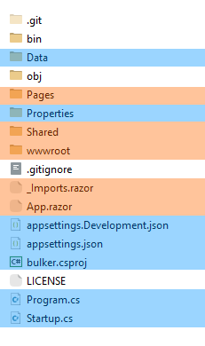

Введение
========

Технический стек
----------------

.. image:: img/blazor.png
    :scale: 25 %

Проект Bulker было решено делать на Web-фреймворке **Blazor**: свежей платформе, позволяющей использовать исключительно C# при написании скриптов для веб-страниц (вместо JavaScript).

Причиной такого решения послужили:

* Знание C# backend-разработчиком;
* Околонулевой опыт в вёрстке и незнание JavaScript frontend-разработчиком.

Раньше проект был поделён на две части, серверная и клиентская часть. Но полагаю, такое деление избыточно, когда всё дело можно объединить в одно монолитное приложение.

Тем более разработка такого дела достаточно удобная: код веб-интерфейса можно менять на лету.

Установка
---------

В качестве инструментов для проекта используются:

* `.NET 5.0 SDK <https://dotnet.microsoft.com/en-us/download/dotnet/thank-you/sdk-5.0.405-windows-x64-installer/>`_
* Одно из этого:
    * `Visual Studio Code <https://visualstudio.microsoft.com/ru/downloads/>`_
    * `Visual Studio Community <https://visualstudio.microsoft.com/ru/downloads/>`_

Структура
---------

Базовый проект – шаблонный Blazor Server. При желании Вы можете снести к чёрту содержание своих папок, но я бы рекомендовал использовать местный код как свою первую опору.

.. glossary::

    Data
        Содержит используемые структуры данных и методы взаимодействия с ними.

    Pages
        Каждая отдельная страница внутри сайта. Например, главная страница, страница "о себе" и т.д.
        Можно встраивать, как и элементы из *Shared*, но рекомендуется их разграничивать.

    Properties
        Настройки компиляции/отладки проекта. Думаю, не придётся трогать.

    Shared
        Разделяемые элементы веб-интерфейса, т.н. "виджеты". Например, это навигационное меню, шапка и т.д.

    wwwroot
        Общая конфигурация сайта. Это основной стиль CSS, иконка сайта, используемые шрифты.

    Program.cs
        Точка входа в программу. По идее на ранних этапах изменять не придётся.

    Startup.cs
        Конфигурация сервера. Используется для добавления новых сервисов (для работы с данными) и посредников (для обеспечения безопасного соединения).

    Деление структуры между frontend (оранжевым) и backend (синим).

.. note::

    Данное деление весьма условно. Например, frontend-разработчику может понадобиться помощь с интеграцией интерфейса с сервером, с написанием кода на C#.

Материалы для ознакомления
--------------------------

* `Microsoft Docs (Русский): Введение в ASP.NET Core Blazor <https://docs.microsoft.com/ru-ru/aspnet/core/blazor/?view=aspnetcore-5.0>`_
* `Microsoft Docs: Build web applications with Blazor <https://docs.microsoft.com/en-us/learn/paths/build-web-apps-with-blazor/>`_
* `YouTube: Blazor for Beginners <https://www.youtube.com/playlist?list=PLdo4fOcmZ0oUJCA3DCzKT79Oe3kdKEceX>`_